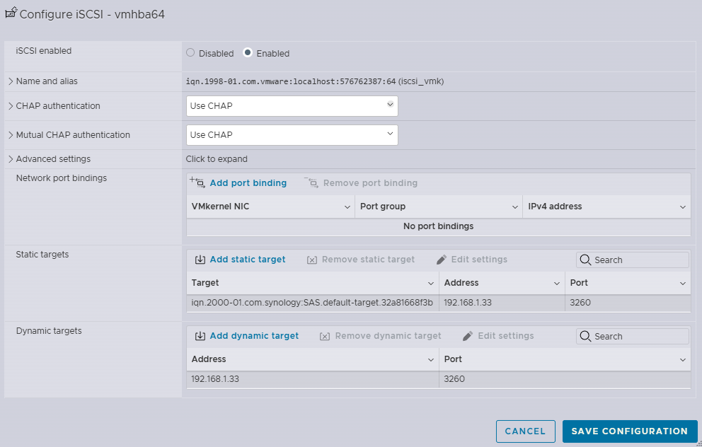
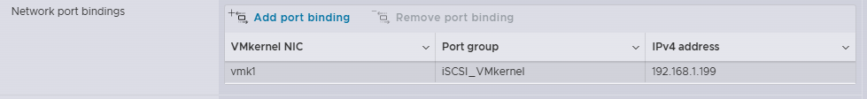
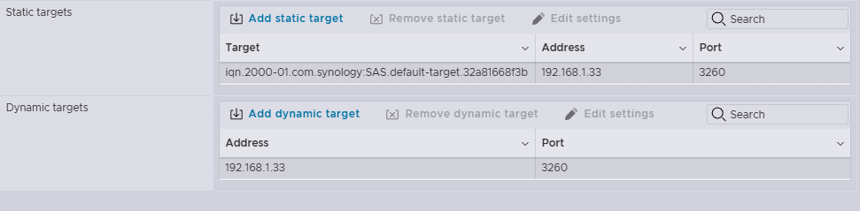
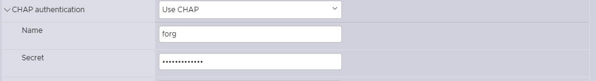
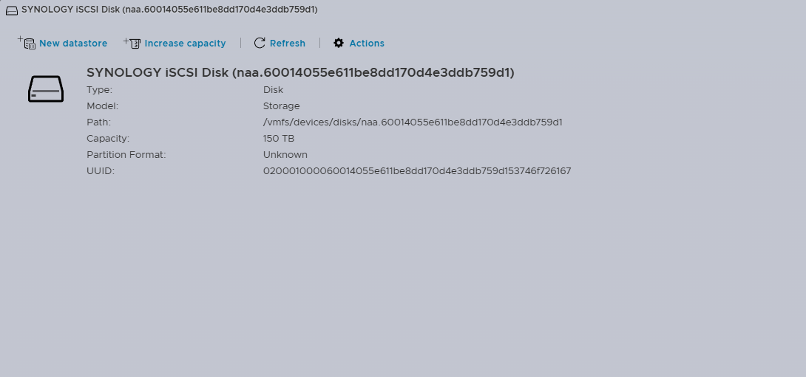
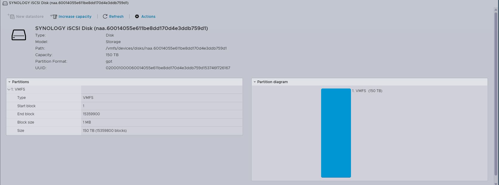
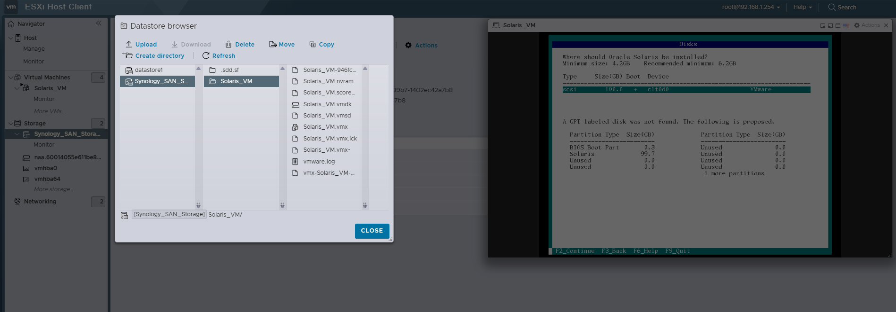

# esxi8-synology-iscsi-datastore
Enterprise deployment of VMware ESXi 8 with Synology SA3400 iSCSI datastore, dual NIC multipathing, VMFS 6, and high-performance storage configuration.

---

## Technologies & Tools
- HPE DL360 Gen9
  - CPU: 2x Intel Xeon E5-2696 v4
  - RAM: 256 GB DDR4
  - NICs: 4x 1GbE LAN, 2x 10GbE LAN, 2x 10Gb Fiber
- VMware ESXi 8.0.3
- Synology SA3400
  - 150 TB usable capacity,
- VMFS Version: VMFS 6
- Protocols: iSCSI
- Dedicated VLAN for iSCSI

---

## Step-by-Step Implementation

### Step 1: Create VMkernel NIC for iSCSI
Create a dedicated VMkernel NIC on ESXi for iSCSI traffic. Ensure the IP is static, on the same subnet as the Synology iSCSI target, and no services are enabled except iSCSI.

---

### Step 2: Enable Software iSCSI Adapter
Add the ESXi software iSCSI adapter and bind it to the VMkernel NIC(s).

---
### Step 3: Bind VMkernel NIC to iSCSI Adapter
Bind the dedicated iSCSI VMkernel NIC(s) to the software iSCSI adapter to ensure proper pathing.

---

### Step 4: Add Synology iSCSI Target
Add the Synology SA3400 iSCSI target via Dynamic Discovery. Enter the Synology IP and port (3260).

---

### Step 5: Configure CHAP Authentication (Optional)
If CHAP is enabled on Synology, configure authentication on ESXi.

---

### Step 6: Rescan iSCSI Adapter and Verify LUN
Rescan the iSCSI adapter and verify that the LUN from Synology appears in **Storage → Devices**.

---

### Step 7: Create VMFS Datastore
Create a VMFS 6 datastore on the detected Synology LUN. Name it `Synology_SAN_Storage`.

---

### Step 8: Validate Datastore
Create a test VM on the datastore, power cycle ESXi, and confirm the datastore mounts automatically.

---

## Security Considerations
- Dedicated iSCSI VLAN to isolate storage traffic from management and vMotion
- CHAP authentication enabled between ESXi and Synology for access control
- VMkernel NICs only carry iSCSI traffic; no management or vMotion services enabled
- ESXi firewall rules reviewed to allow only necessary iSCSI traffic

---

## Results / Impact
- Centralized, redundant 150TB storage with RAID 5
- VMFS 6 datastore `Synology_SAN_Storage` available for production VMs
- Improved storage performance and scalability for client virtual infrastructure
- Fully validated by creating a test VM and rebooting the host

---

## Future Improvements
- Implement 10GbE link aggregation for additional performance
- Add multiple LUNs for VM tiering (e.g., production vs test)
- Integrate vSphere Storage DRS for automatic VM placement and balancing
- Configure monitoring and alerting for iSCSI latency and throughput

---

> This project was designed and implemented by me. ChatGPT was used as a supporting tool for documentation assistance.
