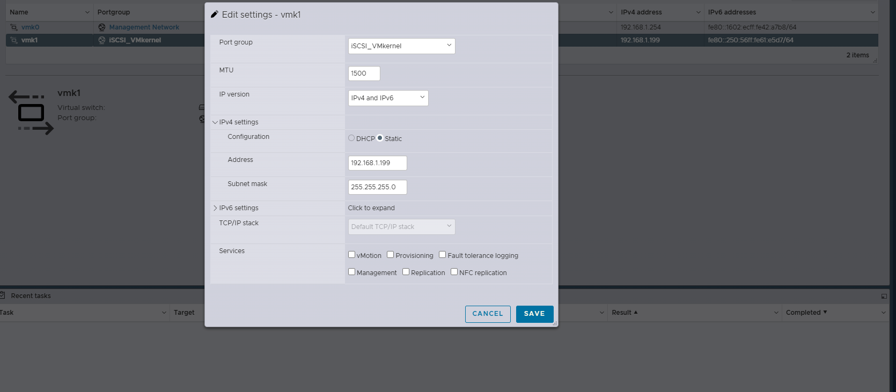

# esxi8-synology-iscsi-datastore
Enterprise deployment of VMware ESXi 8 with Synology SA3400 iSCSI datastore, dual NIC multipathing, VMFS 6, and high-performance storage configuration.

---

## Technologies & Tools
- HPE DL360 Gen9
  - CPU: 2x Intel Xeon E5-2696 v4
  - RAM: 256 GB DDR4
  - NICs: 4x 1GbE LAN, 2x 10GbE LAN, 2x 10Gb Fiber
- VMware ESXi 8.0.3
- Synology SA3400
  - 12 TB usable capacity, RAID 5
- VMFS Version: VMFS 6
- Protocols: iSCSI
- Dedicated VLAN for iSCSI

---

## Step-by-Step Implementation

### Step 1: Create VMkernel NIC for iSCSI
Create a dedicated VMkernel NIC on ESXi for iSCSI traffic. Ensure the IP is static, on the same subnet as the Synology iSCSI target, and no services are enabled except iSCSI.

